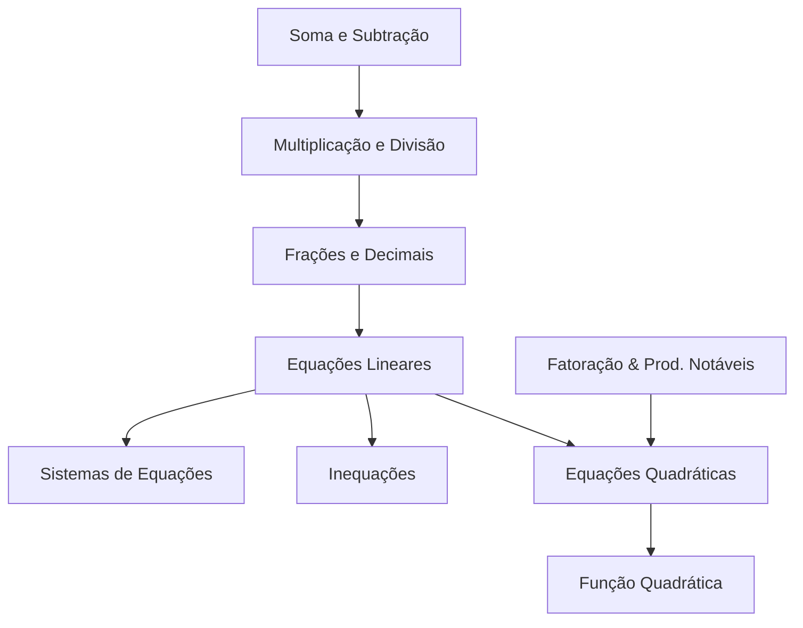

# 🎓 SPEC: Sistema de Adaptação Didática de Matemática & Análise de Progresso (100% Offline)

Este documento estabelece as especificações didáticas, pedagógicas e algoritmos matemáticos necessários para construir o motor de **Análise de Progresso e Ajuste Dinâmico da Árvore de Matemática** rodando localmente (100% offline) no tablet.

---

## 1. Fundamentação Pedagógica (Bases Científicas)

Para manter um aluno engajado em regime de alto rendimento por 100+ horas de forma autônoma, o app adota três pilares pedagógicos clássicos:

1. **Método Kumon (Progressão Milimétrica):** Divisão extrema de habilidades. O avanço ocorre por variações incrementais mínimas de complexidade (apenas 1 variável muda por vez: ex: de `2x = 4` para `2x - 1 = 5` para `-2x = 4`). Isso reduz a sobrecarga cognitiva e induz o "estado de flow".
2. **Bayesian Knowledge Tracing (BKT):** Algoritmo de inteligência artificial educacional para estimar a probabilidade latente de o aluno ter dominado um conceito matemático com base em seu histórico real de tentativas de forma determinística e offline.
3. **Teoria da Carga Cognitiva de Sweller:** Monitoramento de telemetria comportamental da caneta (tempo de hesitação inicial, velocidade de escrita e frequência de apagamentos) para diagnosticar fadiga cognitiva antes que ela resulte em frustração ou abandono.

---

## 2. O Motor de IA Offline: Algoritmo BKT (Bayesian Knowledge Tracing)

O aplicativo rastreia a proficiência do aluno em cada habilidade utilizando o BKT padrão. A cada exercício resolvido, o sistema atualiza a probabilidade de domínio daquela habilidade.

### Os 4 Parâmetros do BKT (Calibrados por Habilidade)

| Parâmetro | Descrição | Valor Aritmética | Valor Álgebra |
|---|---|---|---|
| $P(L_0)$ | Probabilidade inicial de o aluno já saber a habilidade | $0.40$ | $0.20$ |
| $P(T)$ | Probabilidade de aprender o conceito após uma tentativa | $0.25$ | $0.15$ |
| $P(G)$ | Probabilidade de chutar e acertar sem saber (Guess) | $0.10$ | $0.05$ |
| $P(S)$ | Probabilidade de errar por descuido mesmo sabendo (Slip) | $0.05$ | $0.10$ |

### Fórmulas de Atualização Bayesiana (Kotlin Offline)

Quando o aluno responde a um exercício, a probabilidade atualizada de conhecimento $P(L_{t|resposta})$ é calculada:

1. **Se o Aluno ACERTOU:**
   $$P(L_t | Acerto) = \frac{P(L_{t-1}) \cdot (1 - P(S))}{P(L_{t-1}) \cdot (1 - P(S)) + (1 - P(L_{t-1})) \cdot P(G)}$$

2. **Se o Aluno ERROU:**
   $$P(L_t | Erro) = \frac{P(L_{t-1}) \cdot P(S)}{P(L_{t-1}) \cdot P(S) + (1 - P(L_{t-1})) \cdot (1 - P(G))}$$

3. **Cálculo da Transição de Aprendizado:**
   $$P(L_t) = P(L_{t|resposta}) + (1 - P(L_{t|resposta})) \cdot P(T)$$

O aluno atinge a **"Proficiência Técnica (Mastery)"** quando $P(L_t) \ge 0.85$ (85% de certeza pedagógica).

---

## 3. Estrutura Didática: O DAG de Habilidades (Dependency Graph)

As habilidades matemáticas não são lineares; elas formam um **Grafo Direcionado Acíclico (DAG)**. Um nó mais avançado exige proficiência nos nós antecedentes.



### Configuração Declarativa do Grafo (SQLite Local)

Cada habilidade é representada por um nó no banco SQLite:

```kotlin
data class SkillNode(
    val tag: String,
    val displayName: String,
    val prerequisites: List<String>,
    val defaultDifficulty: Float
)
```

---

## 4. O Modelo de Sandbox Aberto & Quarentena por Ineficácia

Diferente de sistemas lineares rígidos, o aplicativo adota um **modelo de Sandbox Aberto**:

1. **100% Destravado desde o Início:** **Todos os nós da Árvore de Matemática nascem destravados.** O aluno tem a liberdade absoluta de selecionar qualquer conteúdo avançado (ex: *Derivadas*) no primeiro dia, sem restrições artificiais de pré-requisitos.
2. **Quarentena por Ineficácia (Bloqueio Dinâmico):**
   - Um nó só é "travado" (entra em quarentena) se o aluno demonstrar **ineficácia crítica de resolução** (ex: acurácia < 40% nas últimas 10 tentativas ou 5 erros seguidos).
   - O status do nó muda no banco local de `"em_progresso"` para `"quarentena"` (visualizado em alerta na árvore).
3. **Penalidade de Persistência (Perda Massiva de Score/MMR):**
   - Se o aluno insistir em manter as tentativas em um nó em quarentena, **o fator de penalização de score é multiplicado exponencialmente**.
   - Cada erro consecutivo em um nó sob alerta gera perda massiva de MMR (ex: -50 MMR por erro em vez dos tradicionais -10 MMR).
   - Essa perda drástica de score tem um "peso enorme" no ranking e no Proof of Work do perfil do aluno.
   - **Efeito Pedagógico Autônomo:** Em vez de uma trava rígida do sistema, a própria mecânica de risco-recompensa ensina o aluno a ter maturidade de estudo. O medo de arruinar seu score global o força a dar um passo atrás voluntariamente para treinar os pré-requisitos antes de retornar ao desafio avançado.


---

## 5. Geração Contínua do Relatório de Análise Cognitiva

Conforme o estudante avança nos exercícios de forma offline, a cada lote (folha de sprint) completada, o app analisa a telemetria comportamental e atualiza o seu **Cognitive Profile Report** local.

### Métricas Analisadas no Relatório Local

1. **Acurácia Estrita:** Porcentagem simples de acertos por habilidade.
2. **Velocidade de Processamento (APM):** Respostas submetidas por minuto e média de tempo por item.
3. **Hesitação Cognitiva:** Tempo médio decorrido entre a renderização do exercício e o primeiro traço físico da caneta (`time_to_first_stroke`). Indica a velocidade de decodificação lógica do problema.
4. **Fator de Reescrita e Correção:** Frequência de apagamentos (`erase_count`) e hesitações no meio da escrita. Indica segurança algorítmica.
5. **Indice de Fadiga Estendida:** Queda de velocidade e precisão ao longo de 45 minutos contínuos.

### Formato do Relatório Persistido (Local JSON)

```json
{
  "student_id": "stu_uuid",
  "generated_at": "2026-05-28 20:15:00",
  "metrics": {
    "global_accuracy": 0.82,
    "average_apm": 4.2,
    "cognitive_load_fatigue": 0.12
  },
  "skills": {
    "soma_subtracao": {
      "mastery_probability": 0.94,
      "status": "forte",
      "avg_hesitation_ms": 1100
    },
    "fracoes_decimais": {
      "mastery_probability": 0.58,
      "status": "treinar",
      "avg_hesitation_ms": 4800
    }
  },
  "pedagogical_recommendation": {
    "action": "BOOST_PREREQUISITE",
    "target_skill": "multiplicacao_divisao",
    "reason": "Frações e Decimais estão apresentando alta hesitação devido a lacunas na Multiplicação/Divisão rápida."
  }
}
```

---

## 6. Integração com o Motor de Exercícios Procedurais

A cada folha de sprint gerada:
1. O motor carrega a habilidade ativa (definida pela fila priorizada do usuário).
2. O sistema extrai a probabilidade de domínio $P(L_t)$ do aluno para essa habilidade no banco local.
3. **Ajuste Procedural Dinâmico:**
   - Se $P(L_t) < 0.60$ (Ainda aprendendo): O gerador procedural seleciona templates com **coeficientes inteiros fáceis e operações simples** (ex: `2x = 6`, `x - 4 = 10`).
   - Se $P(L_t)$ está entre $0.60$ e $0.85$ (Transição): O gerador introduz **sinais negativos e frações básicas** (ex: `-3x = 12`, `x/2 + 1 = 5`).
   - Se $P(L_t) \ge 0.85$ (Mastery): O gerador avança o usuário para a próxima habilidade da fila de estudo e marca visualmente o nó como dominado (Mastery - cor dourada) na árvore.


---

## 7. Próximos Passos de Desenvolvimento

1. **Modelagem de Entidades SQLite:** Adicionar colunas `mastery_probability` e `pedagogical_status` no `StudentSkillMemoryEntity`.
2. **Implementar MathBktEngine.kt:** Escrever a lógica matemática de atualização bayesiana em Kotlin puro.
3. **Refatorar FolhaScreen / MathTreeTab:** Criar a UI interativa de drag-and-drop da fila didática e exibir os nós com cores representativas da probabilidade bayesiana de domínio de cada habilidade.
